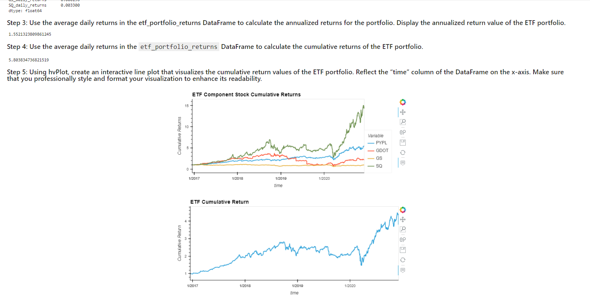
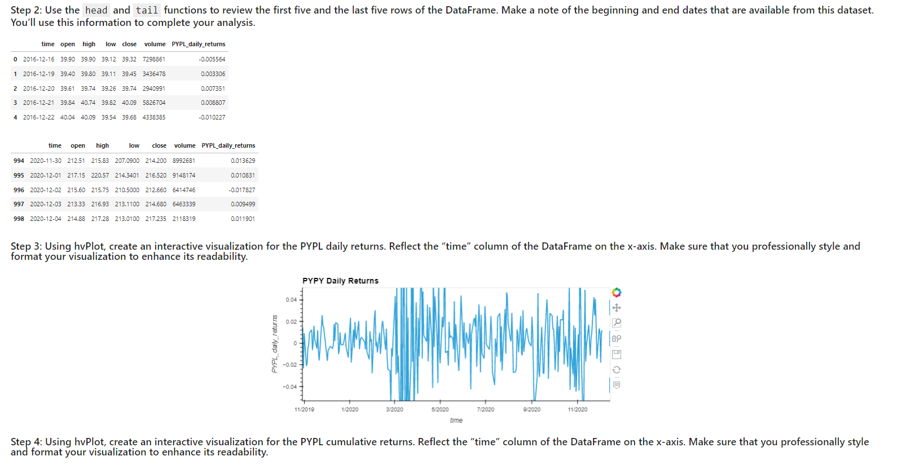

# Module 7 Challenge

The module 7 challenge for fintech course

The Jupyter Lab file follows along to create, update and work with SQL databases by importing them as Pandas Datframes. The worksheet can be launched as a webapplication with Voila

---

## Technologies

The sheet requires Pandas for analyzing data frames in jupyter labs.
It requires Jupyter Labs for a user interface.
It requires Path from pathlib to help read .csv files.
Requires hvplot, SQLAlchemy, and Voila.

---

## Installation Guide

Jupyter Labs runs in a browser, including Chrome.  Launch the file by navigating to the directory of the file through a CLI and then running Jupyter labs, with "jupyter lab".

hvplot and geoviews can be installed form the CLI with the following:

conda install -c pyviz hvplot geoviews

SQLAlchemy and Voila can be installed form the CLI with the following:

pip install SQLAlchemy

and

conda install -c conda-forge voila

---

## Usage

The worksheet runs through a scenario and teaches the user to work with SQL databases.
It can be launched via Voila from Jupyter Lab to allow the user to see all the output and interact with the plots.

---

## Contributors

Michael Canavan

---

## License

The content of the course is owned and managed by UC Berkeley Fintech Bootcamp.